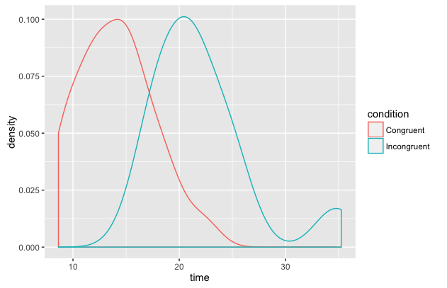

# Project 1: Test a Perceptual Phenomenon

#### 1. What is our independent variable? What is our dependent variable?  
The **independent** variable of a study is the variable that experimenters choose to manipulate; thus it is the **condition of the task** (congruent/incongruent).
The **dependent** variable of a study is the variable that experimenters choose to measure during an experiment; thus it is the the **time** it takes to name the ink colours.

#### 2. What is an appropriate set of hypotheses for this task? What kind of statistical test do you expect to perform? Justify your choices.
**Null hypothesis H<sub>0</sub>: μ<sub>1</sub>=μ<sub>2</sub>**
The mean time it takes to name the ink colours is the same for both conditions of the task (congruent/incongruent).
**Alternative hypothesis H<sub>1</sub>: μ<sub>1</sub>≠μ<sub>2</sub>**
The mean time it takes to name the ink colours is **not** the same for both conditions of the task (congruent/incongruent).
We chose this set of hypotheses as we aim to determine whether one population mean μ<sub>1</sub> (mean time accomplishing congruent task) is equal to a different population mean μ<sub>2</sub> (mean time accomplishing incongruent task).

This experiment has a within-subject design, as we compare two samples that are dependent (each subject is assigned two conditions). Also, we are interested if the mean time is different between tasks, but not greater or less than the other in particular. Thus, we should use a **two-tailed dependent t-test**.

#### 3. Report some descriptive statistics regarding this dataset. Include at least one measure of central tendency and at least one measure of variability.
Congruent task
```r
Mean = 14.05
SD = 3.56
```
Incongruent task
```r
Mean = 22.02
SD = 4.80
```

#### 4. Provide one or two visualizations that show the distribution of the sample data. Write one or two sentences noting what you observe about the plot or plots.
  
We plotted a density distribution of the two variables. It is obvious that the Congruent condition relates to lower times.

#### 5. Now, perform the statistical test and report your results. What is your confidence level and your critical statistic value? Do you reject the null hypothesis or fail to reject it? Come to a conclusion in terms of the experiment task. Did the results match up with your expectations?
```r
t = -8.0207
df = 23
p-value = 4.103e-08
alternative hypothesis: true difference in means is not equal to 0
95 percent confidence interval: -10.019028  -5.910555
mean of the differences : -7.964792
```
For 23 degrees of freedom and an α level of 0.05, the t-critical value is ±2.069. Since our t statistic is past this critical value, **we reject the null hypothesis**. The time to name colours is significantly different at α=0.05 between the two tasks.

Specifically, it takes more time to name the colours during the incongruent task. This result matches up with our intuition.
