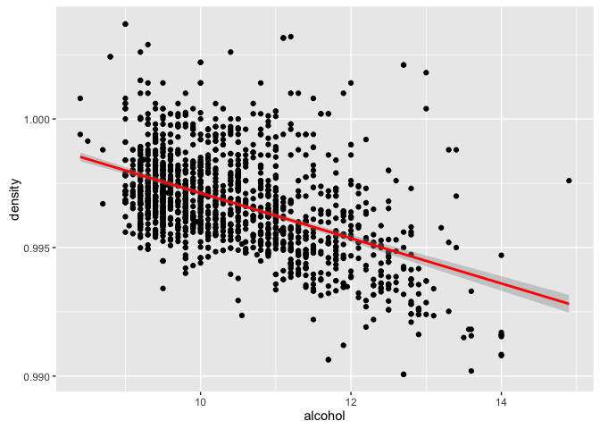
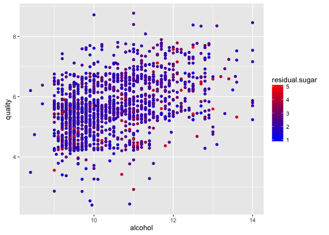

Project 4: Explore and Summarize Data (Red Wine Quality dataset)
========================================================


# Univariate Plots Section

```
## [1] 1599   13
```

```
##  [1] "X"                    "fixed.acidity"        "volatile.acidity"    
##  [4] "citric.acid"          "residual.sugar"       "chlorides"           
##  [7] "free.sulfur.dioxide"  "total.sulfur.dioxide" "density"             
## [10] "pH"                   "sulphates"            "alcohol"             
## [13] "quality"
```

```
## 'data.frame':	1599 obs. of  13 variables:
##  $ X                   : int  1 2 3 4 5 6 7 8 9 10 ...
##  $ fixed.acidity       : num  7.4 7.8 7.8 11.2 7.4 7.4 7.9 7.3 7.8 7.5 ...
##  $ volatile.acidity    : num  0.7 0.88 0.76 0.28 0.7 0.66 0.6 0.65 0.58 0.5 ...
##  $ citric.acid         : num  0 0 0.04 0.56 0 0 0.06 0 0.02 0.36 ...
##  $ residual.sugar      : num  1.9 2.6 2.3 1.9 1.9 1.8 1.6 1.2 2 6.1 ...
##  $ chlorides           : num  0.076 0.098 0.092 0.075 0.076 0.075 0.069 0.065 0.073 0.071 ...
##  $ free.sulfur.dioxide : num  11 25 15 17 11 13 15 15 9 17 ...
##  $ total.sulfur.dioxide: num  34 67 54 60 34 40 59 21 18 102 ...
##  $ density             : num  0.998 0.997 0.997 0.998 0.998 ...
##  $ pH                  : num  3.51 3.2 3.26 3.16 3.51 3.51 3.3 3.39 3.36 3.35 ...
##  $ sulphates           : num  0.56 0.68 0.65 0.58 0.56 0.56 0.46 0.47 0.57 0.8 ...
##  $ alcohol             : num  9.4 9.8 9.8 9.8 9.4 9.4 9.4 10 9.5 10.5 ...
##  $ quality             : int  5 5 5 6 5 5 5 7 7 5 ...
```

```
##        X          fixed.acidity   volatile.acidity  citric.acid   
##  Min.   :   1.0   Min.   : 4.60   Min.   :0.1200   Min.   :0.000  
##  1st Qu.: 400.5   1st Qu.: 7.10   1st Qu.:0.3900   1st Qu.:0.090  
##  Median : 800.0   Median : 7.90   Median :0.5200   Median :0.260  
##  Mean   : 800.0   Mean   : 8.32   Mean   :0.5278   Mean   :0.271  
##  3rd Qu.:1199.5   3rd Qu.: 9.20   3rd Qu.:0.6400   3rd Qu.:0.420  
##  Max.   :1599.0   Max.   :15.90   Max.   :1.5800   Max.   :1.000  
##  residual.sugar     chlorides       free.sulfur.dioxide
##  Min.   : 0.900   Min.   :0.01200   Min.   : 1.00      
##  1st Qu.: 1.900   1st Qu.:0.07000   1st Qu.: 7.00      
##  Median : 2.200   Median :0.07900   Median :14.00      
##  Mean   : 2.539   Mean   :0.08747   Mean   :15.87      
##  3rd Qu.: 2.600   3rd Qu.:0.09000   3rd Qu.:21.00      
##  Max.   :15.500   Max.   :0.61100   Max.   :72.00      
##  total.sulfur.dioxide    density             pH          sulphates     
##  Min.   :  6.00       Min.   :0.9901   Min.   :2.740   Min.   :0.3300  
##  1st Qu.: 22.00       1st Qu.:0.9956   1st Qu.:3.210   1st Qu.:0.5500  
##  Median : 38.00       Median :0.9968   Median :3.310   Median :0.6200  
##  Mean   : 46.47       Mean   :0.9967   Mean   :3.311   Mean   :0.6581  
##  3rd Qu.: 62.00       3rd Qu.:0.9978   3rd Qu.:3.400   3rd Qu.:0.7300  
##  Max.   :289.00       Max.   :1.0037   Max.   :4.010   Max.   :2.0000  
##     alcohol         quality     
##  Min.   : 8.40   Min.   :3.000  
##  1st Qu.: 9.50   1st Qu.:5.000  
##  Median :10.20   Median :6.000  
##  Mean   :10.42   Mean   :5.636  
##  3rd Qu.:11.10   3rd Qu.:6.000  
##  Max.   :14.90   Max.   :8.000
```

We drop the first column -named X-, as it contains a numbered index for each observation, and it is of no use for our analysis.

Most wines have free sulfur dioxide levels below 50ppm (1ppm = 1 mg/dm^3 of water), the threshold to be detectable. 
The density of all wines is close to that of water (1 g/cm^3). 
Most wines are between 3-4 on the pH scale. 
The median rating for quality is 6 and the range of ratings is 3 to 8 on a scale of 0 to 10.

As we have only 11 variables plus one output variable, we can explore with one visualisation all 12 histograms. By doing this, we might be able to spot interesting patterns or features for further analysis.

<!-- -->

The oddest histogram seems to be that of quality. The distribution appears to be bimodal and the ratings fractional, which is not the case since we know the type of this variable is of integer.

<!-- -->

```
## 
##   3   4   5   6   7   8 
##  10  53 681 638 199  18
```

However, drawing a standalone histogram reveals that bimodality is an artefact of gridding the histograms and by narrowing the bin width indicates that quality values are indeed integers. Moreover, printing a contingency table of the quality variable reveals that virtually all quality ratings are between 5 and 7.

Next we will focus on the widest distributions and shorten the bin width, in order to reveal any hidden anomalies.

First, we will zoom in the citric acid histogram.

<!-- -->

A bar chart with small bin width uncovers a high peak for the zero value. We can also observe a couple of other peaks, but otherwise the distribution is relatively normal. To better illustrate this insight, we plot a frequency polygon.

<!-- -->

Next, we concentrate on the two distinct peaks using bar charts with very narrow limits and small bins with appropriate labels. 

<!-- -->

The first peak at 0.24 does not appear to be anything significant.

<!-- -->

But the second at 0.49 is over three times higher than its neighboring values. It may be something important, that we should investigate later.

Subsequently, we will zoom in the alcohol histogram, as it seems to have the second wider distribution.

<!-- -->

We do not observe any hidden details. However, it is remarkable that the bell curve stops abruptly on the left side. We should investigate this cut-off region.

<!-- -->

We see that the peak is at 9.5 an the cut-off value is at 9. In contrast, the right side of the curve ranges from 9.5 to 13.

Next, we will check the two most long tailed histograms for hidden details.

<!-- --><!-- -->

When we zoom in residual.sugar and chlorides histograms we do not observe any anomalies.

Finally, it would be interesting to see how the various features behave for the best and worst wines.


```
## worst    ok  best 
##    63  1319   217
```

```
## wines$quality.level: worst
##        fixed.acidity     volatile.acidity          citric.acid 
##               7.5000               0.6800               0.0800 
##       residual.sugar            chlorides  free.sulfur.dioxide 
##               2.1000               0.0800               9.0000 
## total.sulfur.dioxide              density                   pH 
##              26.0000               0.9966               3.3800 
##            sulphates              alcohol              quality 
##               0.5600              10.0000               4.0000 
## -------------------------------------------------------- 
## wines$quality.level: ok
##        fixed.acidity     volatile.acidity          citric.acid 
##               7.8000               0.5400               0.2400 
##       residual.sugar            chlorides  free.sulfur.dioxide 
##               2.2000               0.0800              14.0000 
## total.sulfur.dioxide              density                   pH 
##              40.0000               0.9968               3.3100 
##            sulphates              alcohol              quality 
##               0.6100              10.0000               5.0000 
## -------------------------------------------------------- 
## wines$quality.level: best
##        fixed.acidity     volatile.acidity          citric.acid 
##              8.70000              0.37000              0.40000 
##       residual.sugar            chlorides  free.sulfur.dioxide 
##              2.30000              0.07300             11.00000 
## total.sulfur.dioxide              density                   pH 
##             27.00000              0.99572              3.27000 
##            sulphates              alcohol              quality 
##              0.74000             11.60000              7.00000
```

We created a categorical variable named quality.level with 3 levels, based on a classification of quality. We also explored the medians of all variables across different quality levels. We will continue down this path in our bivariate analysis.


# Univariate Analysis

### What is the structure of your dataset?
There are 1,599 observations in the dataset with 13 features (X, fixed.acidity, volatile.acidity, citric.acid, residual.sugar, chlorides, free.sulfur.dioxide, total.sulfur.dioxide, density, pH, alcohol and quality). All variables are numerical and quality is the output variable.

Other observations:  
We drop the first column -named X-, as it contains a numbered index for each observation, and it is of no use for our analysis.
Most wines have free sulfur dioxide levels below 50ppm (1ppm = 1 mg/dm^3 of water), the threshold to be detectable. 
The density of all wines is close to that of water (1 g/cm^3). 
Most wines are between 3-4 on the pH scale. 
The median rating for quality is 6 and the range of ratings is 3 to 8 on a scale of 0 to 10.

### What is/are the main feature(s) of interest in your dataset?
The main feature of interest in the data set is quality. It would be very interesting to determine which variables are best for predicting the quality of a wine.

### What other features in the dataset do you think will help support your investigation into your feature(s) of interest?
All features are quantitative and they have also a conceptual association with the sense of wine quality through taste and smell. Hence they can all influence quality.

Nevertheless, we may consider of not being too important the features of free.sulfur.dioxide, total.sulfur.dioxide and density. Sulfur dioxide levels should be undetectable for virtually all observations (according to the accompanying info of the dataset) and density is identical to that of water with not detectable variance.

All the 8 other variables should be carefully investigated.

### Did you create any new variables from existing variables in the dataset?
We created only one new categorical variable to classify quality, so as to facilitate the comparison between best and worst wines. In this way, we will be able to gather insights about which features impact quality, in our multivariate analysis.

### Of the features you investigated, were there any unusual distributions? Did you perform any operations on the data to tidy, adjust, or change the form of the data? If so, why did you do this?
It is worth noting that all variables showed quite normal distributions. We did not observe any especially long tailed histograms, thus we did not use axis transformation for any variable. We only focused on the narrowest and the widest distributions to investigate for any hidden details.

We discovered two such details. The citric.acid distribution has two peaks, one for value zero and another for higher value. Also, the alcohol distribution is skewed to the right, having a cut-off region on the left.


# Bivariate Plots Section

We calculate the correlation matrix


```
##                      fixed.acidity volatile.acidity citric.acid
## fixed.acidity           1.00000000     -0.256130895  0.67170343
## volatile.acidity       -0.25613089      1.000000000 -0.55249568
## citric.acid             0.67170343     -0.552495685  1.00000000
## residual.sugar          0.11477672      0.001917882  0.14357716
## chlorides               0.09370519      0.061297772  0.20382291
## free.sulfur.dioxide    -0.15379419     -0.010503827 -0.06097813
## total.sulfur.dioxide   -0.11318144      0.076470005  0.03553302
## density                 0.66804729      0.022026232  0.36494718
## pH                     -0.68297819      0.234937294 -0.54190414
## sulphates               0.18300566     -0.260986685  0.31277004
## alcohol                -0.06166827     -0.202288027  0.10990325
## quality                 0.12405165     -0.390557780  0.22637251
##                      residual.sugar    chlorides free.sulfur.dioxide
## fixed.acidity           0.114776724  0.093705186        -0.153794193
## volatile.acidity        0.001917882  0.061297772        -0.010503827
## citric.acid             0.143577162  0.203822914        -0.060978129
## residual.sugar          1.000000000  0.055609535         0.187048995
## chlorides               0.055609535  1.000000000         0.005562147
## free.sulfur.dioxide     0.187048995  0.005562147         1.000000000
## total.sulfur.dioxide    0.203027882  0.047400468         0.667666450
## density                 0.355283371  0.200632327        -0.021945831
## pH                     -0.085652422 -0.265026131         0.070377499
## sulphates               0.005527121  0.371260481         0.051657572
## alcohol                 0.042075437 -0.221140545        -0.069408354
## quality                 0.013731637 -0.128906560        -0.050656057
##                      total.sulfur.dioxide     density          pH
## fixed.acidity                 -0.11318144  0.66804729 -0.68297819
## volatile.acidity               0.07647000  0.02202623  0.23493729
## citric.acid                    0.03553302  0.36494718 -0.54190414
## residual.sugar                 0.20302788  0.35528337 -0.08565242
## chlorides                      0.04740047  0.20063233 -0.26502613
## free.sulfur.dioxide            0.66766645 -0.02194583  0.07037750
## total.sulfur.dioxide           1.00000000  0.07126948 -0.06649456
## density                        0.07126948  1.00000000 -0.34169933
## pH                            -0.06649456 -0.34169933  1.00000000
## sulphates                      0.04294684  0.14850641 -0.19664760
## alcohol                       -0.20565394 -0.49617977  0.20563251
## quality                       -0.18510029 -0.17491923 -0.05773139
##                         sulphates     alcohol     quality
## fixed.acidity         0.183005664 -0.06166827  0.12405165
## volatile.acidity     -0.260986685 -0.20228803 -0.39055778
## citric.acid           0.312770044  0.10990325  0.22637251
## residual.sugar        0.005527121  0.04207544  0.01373164
## chlorides             0.371260481 -0.22114054 -0.12890656
## free.sulfur.dioxide   0.051657572 -0.06940835 -0.05065606
## total.sulfur.dioxide  0.042946836 -0.20565394 -0.18510029
## density               0.148506412 -0.49617977 -0.17491923
## pH                   -0.196647602  0.20563251 -0.05773139
## sulphates             1.000000000  0.09359475  0.25139708
## alcohol               0.093594750  1.00000000  0.47616632
## quality               0.251397079  0.47616632  1.00000000
```

We take note of the pairs which are at least moderately correlated (r>0.5):  
fixed.acidity correlates with citric.acid, density and pH.  
volatile.acidity correlates with citric.acid.  
citric.acid correlates with pH  
free.sulfur.dioxide correlates with total.sulfur.dioxide  
density correlates with alcohol  
alcohol correlates with quality  

<!-- -->

First, we focus on the last column showing box plots across quality levels for each variable.The most distinctive differences in IQRs between worst and best groups (smallest overlap) are spotted mainly for volatile.acidity, citric.acid and alcohol, as well for fixed.acidity and sulphates to a lesser extent. We may verify numerically our hypothesis by using a simple metric.


```
##          citric.acid              quality     volatile.acidity 
##         4.0000000000         0.7500000000         0.4558823529 
##            sulphates  free.sulfur.dioxide              alcohol 
##         0.3214285714         0.2222222222         0.1600000000 
##        fixed.acidity       residual.sugar            chlorides 
##         0.1600000000         0.0952380952         0.0875000000 
## total.sulfur.dioxide                   pH              density 
##         0.0384615385         0.0325443787         0.0008830022
```

Indeed, when calculating the relative difference of the medians of each group for every variable, these variables stand out. Therefore, it is probable they influence quality strongly. We will investigate further these relations by comparing the distributions of best and worst wines across these variables.

<!-- -->

It seems that better quality is related to lower levels of volatile.acidity.

<!-- -->

Better quality relates to higher concentrations of citric.acid. Here we note also that the peak at 0.49 we have already observed, is explained by wines of better quality.

<!-- -->

Here also, higher levels of alcohol give wine of better quality. Moreover, the cut-off region at 9 seems to be the lower limit for the majority of wines (quality.level 'ok'), beyond which wines are rated badly.

<!-- -->

<!-- -->

On the last two plots we observe a weak but noticeable differentiation on quality for higher values.

Next we should take a closer look at scatter plots of pairs with the highest correlation.

<!-- -->

We observe a quite strong linear relation between fixed.acidity and citric.acid. As these variables measure the concentrations of different chemical compounds, it is unlikely to exist a causal relation between them, rather there may be a lurking variable affecting both.

<!-- -->

We may also follow the previous reasoning for the pair volatile.acidity and citric.acid. The only difference is that here the correlation is negative.

Next we will look into the relation between acids and pH.

<!-- --><!-- -->

For both pairs we observe that as the concentration of the acid increases, the pH decreases. This is expected as pH measures the total acidity of the solution, with lower values corresponding to greater acidity. As a result, pH and acids are not independent variables.

Next we will investigate the correlation between density and chemical compounds. 

<!-- --><!-- -->

As fixed.acidity increases, density also increases. With a quick search on the web we find that the density of tartaric acid (the concentration of which is measured by fixed.acidity) is 1.79, being higher than the density of water which is 1. It is expected then, as the concentration of a denser solute increases, the overall density also increases.  
In the second plot we observe that as alcohol concentration increases, the density decreases. This is explained as previous, taking into account that the density of ethanol is 0.789 < 1.  
Overall, we conclude that density is strongly dependent on the concentration of chemical compounds.

<!-- -->

The relation between total.sulfur.dioxide and free.sulfur.dioxide is easily explained as total.sulfur.dioxide includes free.sulfur.dioxide.

Finally, we have already examined the pair of alcohol and quality, using a box plot and a density plot.

From all the pairs involving quality, we found the strongest correlation to be in alcohol vs quality. So, let's create a simple linear model with only alcohol as predictor variable to quantify this trend.


```
## 
## Call:
## lm(formula = quality ~ alcohol, data = wines)
## 
## Residuals:
##     Min      1Q  Median      3Q     Max 
## -2.8442 -0.4112 -0.1690  0.5166  2.5888 
## 
## Coefficients:
##             Estimate Std. Error t value Pr(>|t|)    
## (Intercept)  1.87497    0.17471   10.73   <2e-16 ***
## alcohol      0.36084    0.01668   21.64   <2e-16 ***
## ---
## Signif. codes:  0 '***' 0.001 '**' 0.01 '*' 0.05 '.' 0.1 ' ' 1
## 
## Residual standard error: 0.7104 on 1597 degrees of freedom
## Multiple R-squared:  0.2267,	Adjusted R-squared:  0.2263 
## F-statistic: 468.3 on 1 and 1597 DF,  p-value: < 2.2e-16
```

Based on the R^2 value, alcohol explains about 23 percent of the variance in quality.

# Bivariate Analysis

### Talk about some of the relationships you observed in this part of the investigation. How did the feature(s) of interest vary with other features in the dataset?
By taking into account the relevant scatter plots and correlation coefficients, we have discovered a positive correlation between the pairs: fixed.acidity and citric.acid, fixed.acidity and quality.level, citric.acid and quality.level.

On the other hand, a negative correlation was revealed between: volatile.acidity and citric.acid, volatile.acidity and quality.level. These findings are consistent with the fact that citric.acid and quality.level are positively correlated.

For fixed.acidity, volatile.acidity and citric.acid, in spite of measuring the concentration of three different chemical compounds, a mechanism seems to exist linking one another and all of them with wine quality.

Finally, a strong positive correlation was found between alcohol and quality. This was verified by using a scatter plot, a box plot  and a density plot across quality groups and a linear model. Based on the R^2 value, alcohol explains about 23 percent of the variance in quality.

### Did you observe any interesting relationships between the other features (not the main feature(s) of interest)?
An expected relationship was confirmed between concentration of chemicals and density of the solution, as also between concentration of acids and pH. Density and pH are macroscopic properties that weight the proportion of different chemical compounds. Inevitably, these are variables dependent to microscopic properties.

Also, free.sulfur.dioxide was found to be correlated with total.sulfur.dioxide, which is trivial as the later is superset of the first.

### What was the strongest relationship you found?
The strongest relationship was measured to be between fixed.acidity and citric.acid, but this is not very helpful as even they are associated with quality, it is a weak link. In this perspective, the strongest relationship of quality is that with alcohol. This was evidenced on multiple ways.


# Multivariate Plots Section

Up to this point we have found that alcohol has the strongest effect on quality. We will use this finding by drawing scatter plots of quality vs alcohol and then colour by features that have not come up yet in our analysis, so as to clarify their role.

The y axis will have discrete values and thus it will cause overplotting. We can mitigate this by jittering vertically our data points. We will not use the alpha parameter to avoid mixing up the colors.

<!-- -->

We know that the residual.sugar histogram is long tailed, so we should try again by excluding the top 5% of values.

<!-- -->

Even now, nothing stands out in the plot above. We will take the same approach for chlorides.

<!-- -->

The same here. We can not attribute some of the variation in quality to chlorides.

<!-- --><!-- -->

Also free.sulfur.dioxide appears to be evenly distributed. In contrast, for total.sulfur.dioxide seem to be a subtle tendency for lower values to associate with higher quality. Nevertheless, this is not a reliable finding as the values of free.sulfur.dioxide are below the limit to be detected.

<!-- -->

For sulphates we observe a very weak clustering of higher values in the region of high alcohol and high quality. This may imply a positive correlation of sulphates with quality.

So far, we have characterised some variables as dependent to others (pH, density) and some others as irrelevant to quality (residual.sugar, chlorides, sulfur.dioxides). Now, we will try to build a linear model using the independent and more significant variables to predict the quality of wine.


```
## 
## Calls:
## m1: lm(formula = quality ~ alcohol, data = wines)
## m2: lm(formula = quality ~ alcohol + citric.acid, data = wines)
## m3: lm(formula = quality ~ alcohol + citric.acid + fixed.acidity, 
##     data = wines)
## m4: lm(formula = quality ~ alcohol + citric.acid + fixed.acidity + 
##     volatile.acidity, data = wines)
## m5: lm(formula = quality ~ alcohol + citric.acid + fixed.acidity + 
##     volatile.acidity + sulphates, data = wines)
## 
## ===========================================================================
##                        m1         m2         m3         m4         m5      
## ---------------------------------------------------------------------------
##   (Intercept)        1.875***   1.830***   1.563***   2.622***   2.202***  
##                     (0.175)    (0.171)    (0.211)    (0.219)    (0.224)    
##   alcohol            0.361***   0.346***   0.353***   0.325***   0.320***  
##                     (0.017)    (0.016)    (0.017)    (0.016)    (0.016)    
##   citric.acid                   0.730***   0.548***  -0.314*    -0.469***  
##                                (0.090)    (0.123)    (0.137)    (0.137)    
##   fixed.acidity                            0.030*     0.056***   0.057***  
##                                           (0.014)    (0.013)    (0.013)    
##   volatile.acidity                                   -1.420***  -1.343***  
##                                                      (0.115)    (0.113)    
##   sulphates                                                      0.701***  
##                                                                 (0.103)    
## ---------------------------------------------------------------------------
##   R-squared              0.2        0.3        0.3        0.3        0.3   
##   adj. R-squared         0.2        0.3        0.3        0.3        0.3   
##   sigma                  0.7        0.7        0.7        0.7        0.7   
##   F                    468.3      276.6      186.4      191.6      167.0   
##   p                      0.0        0.0        0.0        0.0        0.0   
##   Log-likelihood     -1721.1    -1688.7    -1686.4    -1612.7    -1589.6   
##   Deviance             805.9      773.9      771.7      703.8      683.7   
##   AIC                 3448.1     3385.4     3382.8     3237.5     3193.3   
##   BIC                 3464.2     3406.9     3409.6     3269.7     3230.9   
##   N                   1599       1599       1599       1599       1599     
## ===========================================================================
```

```
## 
## Call:
## lm(formula = quality ~ alcohol + citric.acid + fixed.acidity + 
##     volatile.acidity + sulphates, data = wines)
## 
## Residuals:
##      Min       1Q   Median       3Q      Max 
## -2.77675 -0.38239 -0.06442  0.46373  2.12392 
## 
## Coefficients:
##                  Estimate Std. Error t value Pr(>|t|)    
## (Intercept)       2.20224    0.22444   9.812  < 2e-16 ***
## alcohol           0.31992    0.01592  20.101  < 2e-16 ***
## citric.acid      -0.46867    0.13665  -3.430  0.00062 ***
## fixed.acidity     0.05698    0.01310   4.351 1.44e-05 ***
## volatile.acidity -1.34300    0.11346 -11.837  < 2e-16 ***
## sulphates         0.70056    0.10254   6.832 1.19e-11 ***
## ---
## Signif. codes:  0 '***' 0.001 '**' 0.01 '*' 0.05 '.' 0.1 ' ' 1
## 
## Residual standard error: 0.6551 on 1593 degrees of freedom
## Multiple R-squared:  0.3439,	Adjusted R-squared:  0.3419 
## F-statistic:   167 on 5 and 1593 DF,  p-value: < 2.2e-16
```

The variables in this linear model can account for 34% of the variance in the quality of wines.

# Multivariate Analysis

### Talk about some of the relationships you observed in this part of the investigation. Were there features that strengthened each other in terms of looking at your feature(s) of interest?
We explored variables that did not come up in our previous analysis, but sulphates was the only feature that varied with quality. Holding alcohol level constant, wines with higher sulphates level tend to have better quality.

Also, we used all the independent variables affecting quality in a linear model, measuring the contribution of each one to the quality level.

### Were there any interesting or surprising interactions between features?
We might have expected that residual.sugar and chlorides would be able to affect quality, as they differentiate taste independently from acids and alcohol. Nevertheless, we did not detect any variance in quality due to these factors.

### OPTIONAL: Did you create any models with your dataset? Discuss the strengths and limitations of your model.
Indeed, we created a linear model including all variables that we have found to affect quality to greater or lesser extent. However, our linear model can account only for 34% of the variance in the quality of wines, indicating that other important properties for wine quality should also exist.

------

# Final Plots and Summary

### Plot One
<!-- -->

### Description One
The distribution of citric acid concentrations in wines shows distinctive peaks, which indicate different types of wine and thus different quality levels.

### Plot Two
<!-- -->

### Description Two
Higher levels of alcohol are correlated with wine of better quality. Also, wines are rated badly when they have alcohol content bellow 9%.

### Plot Three
<!-- -->

### Description Three
Holding alcohol concentration constant, wines with same residual sugar levels are rated randomly. Hence, we can not attribute some of the variation in quality to residual sugar. This is unexpected, as we may have thought that sweetness affects the quality of a wine.

------

# Reflection
The wines data set contains information on 1,600 wines from around 2009 and provides measurements of concentration of various chemical compounds. These features are linked to the different constituents of taste: acids with sourness, sugar with sweetness, chlorides with saltiness and alcohol with bitterness. I started by understanding the individual variables in the data set, and then I explored interesting relations between features as I continued to make observations on plots. Eventually, I explored the quality of wines across many variables and created a linear model to predict wines quality. I was surprised that residual sugar and chlorides did not have a strong correlation with wine quality, as they are able to influence largely a flavor. Also, the linear model did not perform very well. The variables taken into account could predict a small proportion of wine quality. A bigger data set would be better to make predictions of  quality, and comparisons might be made between the other linear models to see if other variables may account for wine quality.

